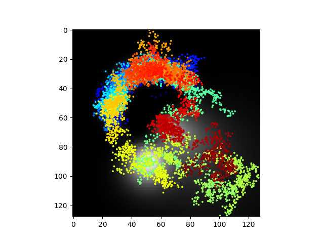
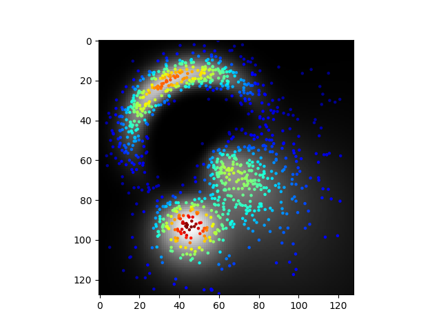

# metropolis_langevin
Metropolis Adjusted Langevin Algorithm, example in 2D.

Toy example. The distribution is a mixture of log-polar 'gaussians'.

A sample is made by 'partially' solving a stochastic differential equation with an addition Metropolis acceptance step.

Very interesting stuff... here are some samples.

